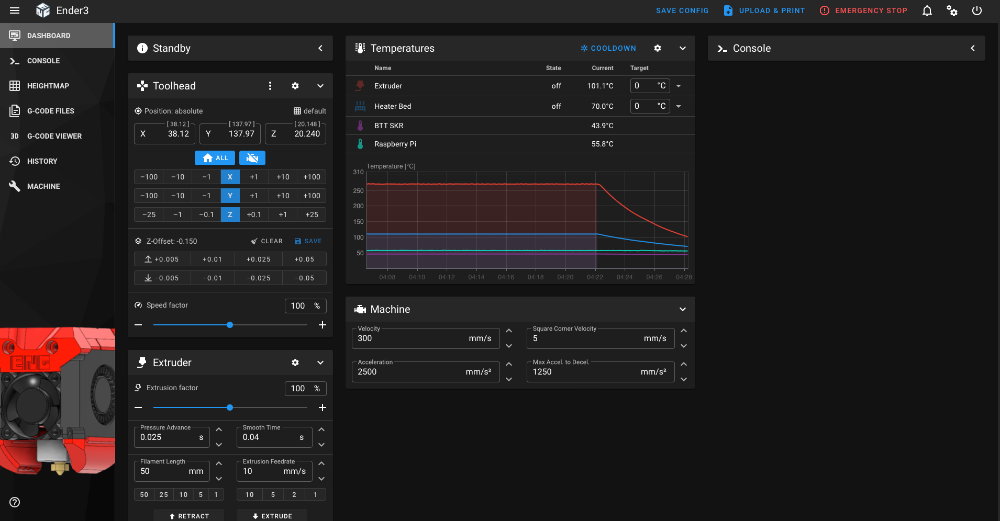
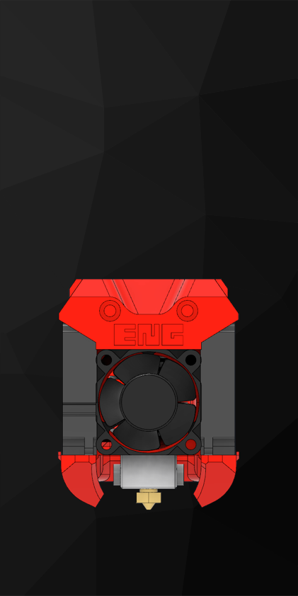
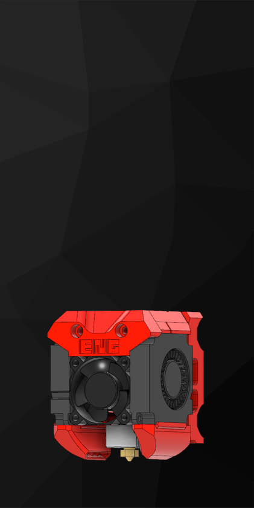
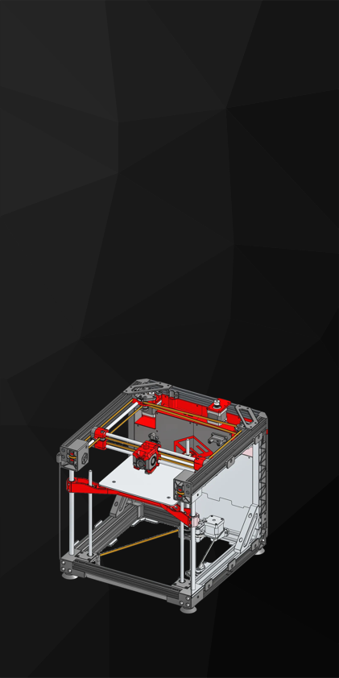

# E3NG-Mainsail-Theme
 
 A basic Mainsail theme based on the [Ender 3 NG](https://www.printables.com/model/469280-ender-3-ng-corexy-beta).

## Install via [Mainsail's theme instructions](https://docs.mainsail.xyz/overview/features/themes):

* Create the `.theme` directory in the config path
* Copy the following files into `.theme`
    * [sidebar-logo.png](https://github.com/TonySac/E3NG-Mainsail-Theme/blob/main/sidebar-logo.png)
    * [favicon-32x32.png](https://github.com/TonySac/E3NG-Mainsail-Theme/blob/main/favicon-32x32.png)
    * [favicon-16x16.png](https://github.com/TonySac/E3NG-Mainsail-Theme/blob/main/favicon-16x16.png)
    * [sidebar-background.png](https://github.com/TonySac/E3NG-Mainsail-Theme/blob/main/sidebar-background.png)
        * Or choose a different sidebar from the [Additional_Sidebars folder](https://github.com/TonySac/E3NG-Mainsail-Theme/tree/main/Additional_Sidebars). <small>Be sure to rename it to `sidebar-background.png`.</small>

## Clone Directly

```bash
git clone https://github.com/TonySac/E3NG-Mainsail-Theme.git ~/printer_data/config/.theme
```

## Screenshots




